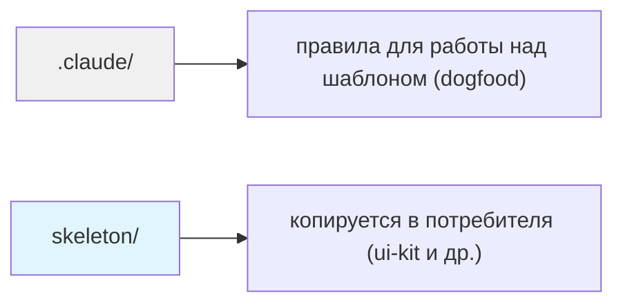
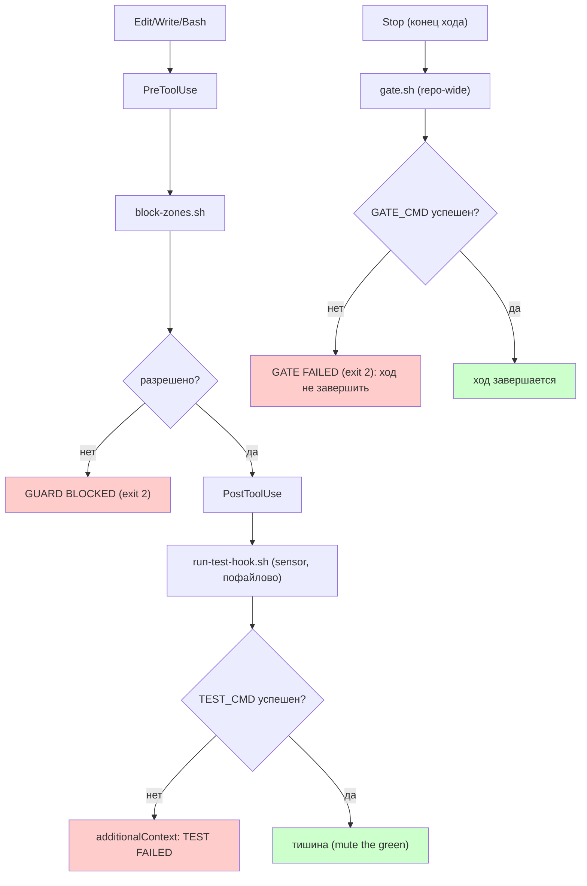
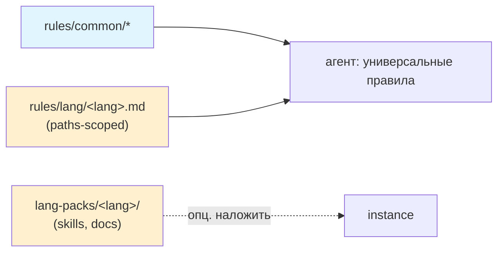

# harness-template

Language-agnostic шаблон харнесса для **Claude Code** и **Cursor**.

Харнесс = `CLAUDE.md` + хуки (guard/sensor/gate) + skills + path-scoped rules + связь с
долгосрочной памятью. Ядро не зависит от стека: подходит Vue, Go, PHP, бэкенду, лидам.
Языковая специфика — отдельным слоем (`rules/lang/` + `lang-packs/`).

# Зачем нужен
Языковая модель по природе недетерминирована: мыслит токенами, выдаёт разные результаты, не знает специфики кодовой базы. Неструктурированные агенты застревают, галлюцинируют, незаметно ломают логику.

Харнесс компенсирует то, чего модель не может в одиночку:

- управление контекстом — не дать агенту попасть в «глупую зону» (dumb zone)
- верификация — не доверять выводу, а проверять
- оркестрация — разбивать длинные задачи на шаги с сохранением состояния
- изоляция — безопасное выполнение в песочницах

---

## 5-шаговый setup

```bash
# 1. Скопируй ядро skeleton в корень своего проекта
cp -r skeleton/.claude ./
cp skeleton/.harness.conf.example .harness.conf

# 2. Заполни .harness.conf под свой проект
#    WATCH_DIR, READONLY_ZONES, TEST_CMD, WIKI_PATH

# 3. Сделай скрипты исполняемыми
chmod +x .claude/guards/*.sh .claude/skills/note/append.sh

# 4. Создай CLAUDE.md из шаблона
cp skeleton/CLAUDE.md.template CLAUDE.md
# Замени плейсхолдеры: <PROJECT_NAME>, <PACKAGE_PATH>, <STACK>, <TEST_CMD> ...

# 5. (опц.) Наложи языковой пакет, если он есть под твой стек
cp -r skeleton/lang-packs/vue/skills/* .claude/skills/      # пример для Vue
#    оставь нужный rules/lang/<lang>.md, удали лишние

# 6. Проверь харнесс
bash scripts/verify-harness.sh
```

> **§5 — template = пример, не готовый инструмент.** `scripts/verify-harness.sh` читает
> `.harness.conf`. Если в instance этого файла нет (зоны/пути захардкожены прямо в guard) —
> перепиши verify под чтение зон из своего `block-zones.sh`, не копируй вслепую. Любой
> generic-скрипт после переноса в instance проверяй прогоном: молчащий/падающий скрипт в
> репе хуже его отсутствия — создаёт ложное чувство покрытия.

---

## Dual-tool: Claude Code + Cursor

Оба инструмента в работе. Хуки настраиваются в обоих, но указывают на **одни и те же**
скрипты `guards/` — логика не дублируется:

| Инструмент | Конфиг | Механика |
|-----------|--------|----------|
| Claude Code | `.claude/settings.json` | `PreToolUse`/`PostToolUse` → `bash guards/*.sh` |
| Cursor | `.cursor/hooks.json` | `postToolUse` (exit 2 блокирует) → те же `guards/*.sh` |

Меняешь guard-логику один раз в скрипте — работает в обоих.

---

## Почему скелет так устроен

Три механизма Claude Code объясняют структуру папок. Скелет стоит на них.

- **Skills, а не commands.** Команда живёт в `.claude/skills/<name>/SKILL.md`: frontmatter,
  bundled-скрипты, автономный вызов агентом. `.claude/commands/*.md` ещё работает, но это legacy.
- **Path-scoped rules.** Правило в `.claude/rules/*.md` с frontmatter `paths:` грузится только
  на совпавших файлах. Без `paths` грузится всегда. Так тяжёлое знание не висит в контексте постоянно.
- **Хуки решают, CLAUDE.md советует.** «Должно случаться каждый раз» — это хук (детерминированно,
  exit-код). Поэтому guard/sensor/gate живут скриптами, а не строчкой в инструкции.

Док: [skills & slash commands](https://code.claude.com/docs/en/skills),
[memory & rules](https://code.claude.com/docs/en/memory).

---

## Структура репо

> Диаграммы и дерево обновляются вручную при изменении структуры (правило в `CLAUDE.md`).

### Два слоя репо



### Runtime flow



### Ядро + языковые слои



### Дерево

```
harness-template/
├── CLAUDE.md                       ← правила для работы над шаблоном (dogfood)
├── .claude/                        ← харнесс этой репы; dogfood capture-flow
│   └── skills/note/                ← /note живой (sensor/guard не нужны: нет билда/тестов)
├── skeleton/                       ← КОПИРУЕТСЯ в потребителя
│   ├── CLAUDE.md.template          ← роутер с плейсхолдерами
│   ├── PACKAGE_CLAUDE.md.template  ← guide пакета (generic)
│   ├── .claude/
│   │   ├── settings.json.template  ← хуки: PreToolUse(guard), PostToolUse(sensor), Stop(gate), SessionStart/End
│   │   ├── guards/
│   │   │   ├── block-zones.sh      ← guard: читает READONLY_ZONES
│   │   │   ├── run-test-hook.sh    ← sensor: WATCH_DIR + TEST_CMD (пофайлово)
│   │   │   └── gate.sh             ← gate: GATE_CMD repo-wide (Stop + pre-push, loop-safe)
│   │   ├── skills/                 ← команды (текущий стандарт)
│   │   │   ├── note/               ← /note: capture в PENDING-NOTES.md
│   │   │   ├── task/               ← /task: шаблон промпта
│   │   │   └── end-session/        ← /end-session: triage + лог
│   │   ├── rules/                  ← common-core + per-language
│   │   │   ├── common/             ← workflow, testing, git (всегда)
│   │   │   └── lang/               ← vue.md, go.md, php.md (paths-scoped)
│   │   └── docs/                   ← проектная память (JIT)
│   │       ├── ARCHITECTURE.md.template  ← generic
│   │       ├── REVIEW.md.template        ← generic
│   │       └── gotchas.md.template       ← реестр ловушек (§-нумерация)
│   ├── lang-packs/                 ← языковые пакеты поверх ядра
│   │   └── vue/                    ← пример: add-component, dev-guide, Vue-ревью
│   ├── scripts/load-context.sh     ← SessionStart: грузит внешнюю вики (опц.)
│   ├── .cursor/hooks.json          ← делегирует к .claude/guards/ (dual-tool)
│   └── .harness.conf.example       ← все параметры с комментариями
├── examples/minimal/               ← рабочий минимальный пример
├── scripts/verify-harness.sh       ← smoke test (guard exit 2, sensor green, /note)
└── docs/specify-implement-review.md ← методология Specify → Implement → Review
```

**Три яруса:** абстрактный `skeleton/` (ядро) → минимальный `examples/minimal/` →
реальный instance (`turbo-omni/packages/ui-kit`, Vue).

---

## Language-agnostic: common-core + per-language

Ядро универсально; стек добавляется тонким слоем, «специфика поверх общего»:

| Слой | Что | Когда грузится |
|------|-----|----------------|
| `rules/common/*.md` | workflow, testing, git — любой стек | Всегда |
| `rules/lang/<lang>.md` | идиомы языка (`paths:` frontmatter) | Только на совпавших файлах |
| `lang-packs/<lang>/` | skills + docs под стек (напр. `/add-component`) | Опц. накладываешь при setup |

Go/PHP/др. — пишешь свой `rules/lang/<lang>.md` (есть stub-примеры) и опционально
lang-pack. Generic-ядро не трогаешь.

---

## Параметры конфигурации (.harness.conf)

| Переменная | Описание | Пример (ui-kit) |
|-----------|----------|-----------------|
| `WATCH_DIR` | Директория для sensor-хука | `packages/ui-kit/lib` |
| `READONLY_ZONES` | Запрещённые для записи зоны | `dist storybook-static` |
| `TEST_CMD` | Команда сенсора (пофайлово) | `vitest related --run` |
| `GATE_CMD` | Команда gate (repo-wide: typecheck+lint+build) | `turbo type-check lint build` |
| `WIKI_PATH` | Путь к долгосрочной памяти | `/path/to/TechWiki/ui-kit-harness` |

---

## Capture-flow: наблюдения не теряются

Наблюдение всплывает в середине работы — записать сразу, разобрать потом.

```
/note hex в CSS не ловится ни guard ни sensor   →  append в .claude/PENDING-NOTES.md
/note [generic] sensor молчит при exit 0            (timestamp, без LLM-раунда)
        │
        ▼  (в конце сессии)
/end-session → triage буфера:
        one-off          → log.md
        recurring rule   → §N в .claude/docs/gotchas.md
        решение          → ADR в decisions.md
        [generic]        → дублировать в слой template
        → буфер очищен
```

`/note` исполняется через инлайн-bash (`!`...``) — детерминированно, без обращения к
модели и без permission-промпта. Агент тоже кладёт наблюдения в буфер (через `append.sh`),
не только пользователь. `gotchas.md` закрывает пробел: code-quality нарушения (токены,
цвета, классы), которые ни линтер, ни sensor, ни guard не отлавливают.

---

## Долгосрочная память: выбирай своё

`load-context.sh` — пример одного подхода: грузить `overview.md` + `log.md` из внешней вики.
Не стандарт. Три рабочих варианта:

| Вариант | Где хранить | Когда выбирать |
|---------|-------------|----------------|
| `.claude/docs/` | В репо (в git) | Команда, CI-агенты, версионируемость |
| Внешняя вики | TechWiki / Notion / Confluence | Личный нарратив, кросс-проектный контекст |
| Только CLAUDE.md | Нигде отдельно | Маленький проект, один разработчик |

`.claude/docs/` грузится по требованию через `@.claude/docs/ARCHITECTURE.md` — не автоматически.

**Принцип один: агент надёжен настолько, насколько надёжна среда вокруг него.**

---

## When NOT to use

- Проект < 1 недели жизни — overhead не окупится
- Нет тестов — sensor без тестов бесполезен
- Один разработчик без AI-агентов — харнесс для агентов, не для людей

---

## Первый instance

`turbo-omni/packages/ui-kit` — Vue 3 компонентная библиотека.
Forcing function: шаблон готов только когда ui-kit на нём реально работает.
