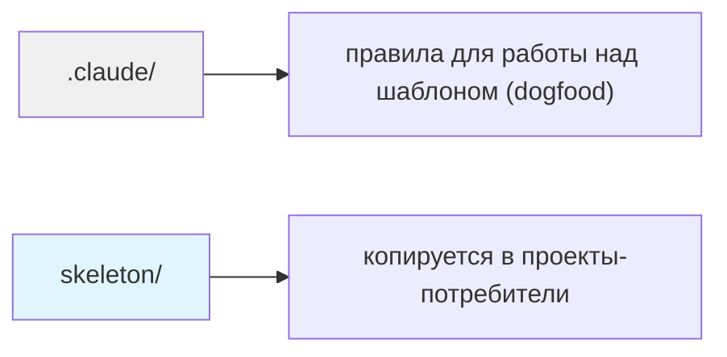
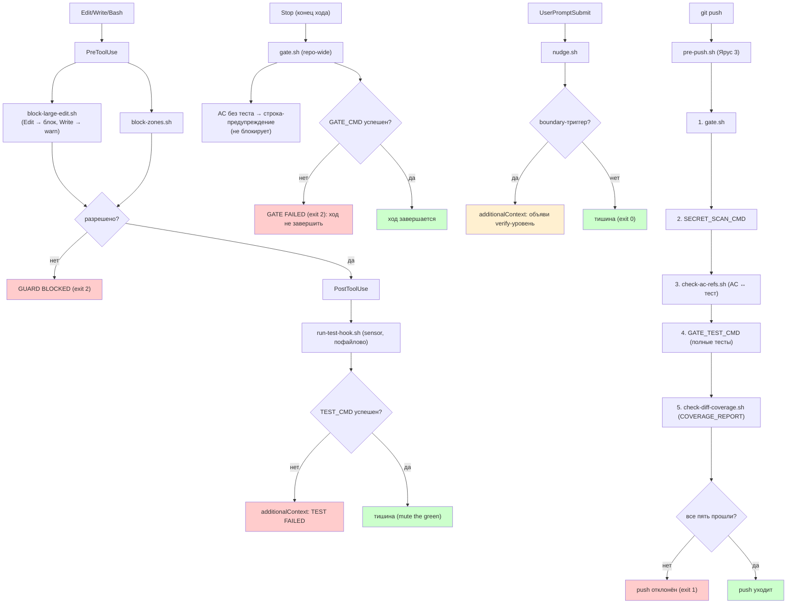
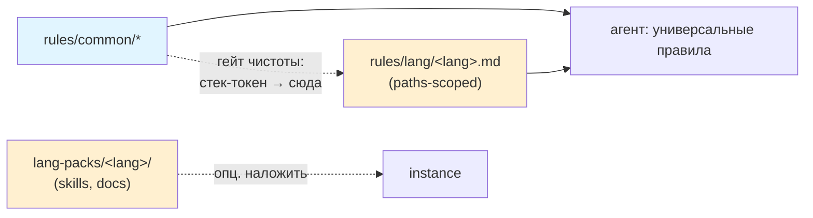

# Как устроен harness-template

Справочник по структуре и механике. README даёт вход за 5 минут; здесь — детали по нужде.

## Содержание
- [Версионируемый sync (Copier)](#версионируемый-sync-copier)
- [Почему скелет так устроен](#почему-скелет-так-устроен)
- [Структура репо](#структура-репо)
- [Language-agnostic: common-core + per-language](#language-agnostic-common-core--per-language)
- [Capture-flow](#capture-flow)
- [Долгосрочная память](#долгосрочная-память)

## Версионируемый sync (Copier)

CORE-слой синкается через [Copier](https://copier.readthedocs.io): guards,
skills/{plan,rename,note,end-session,task}, rules/common **и `scripts/` — 7 скриптов, на
которые CORE-правила ссылаются напрямую**. Состав CORE задан списком `CORE_PATHS` в
`scripts/lib/layers.sh`, он же источник истины для самопроверки обоих каналов.

Установка один раз:

```bash
brew install pipx && pipx ensurepath
pipx install copier
```

Версия CORE = git-тег темплейта (`vX.Y.Z`); инстанс помнит свою в `.copier-answers.yml` и тянет обновления
`copier update`. Дрейф CORE проверяется `scripts/harness-status.sh <instance>`.
Ручной `cp`-setup (см. README → раздел «Setup») — для слоёв вне CORE и первичной раскатки.

**Обратный канал (инстанс → шаблон):** улучшение CORE, найденное в инстансе, поднимается
`scripts/harness-contribute.sh <instance>` (копирует CORE-изменения + печатает diff; git/PR за
человеком).

Карту своих инстансов держи локально: она про чужие рабочие каталоги, в публичный шаблон такому
не место (`/REGISTRY.md` в `.gitignore` — файл живёт у владельца, в клоне его нет).

## Почему скелет так устроен

Три механизма Claude Code объясняют структуру папок. Скелет стоит на них.

- **Skills, а не commands.** Команда живёт в `.claude/skills/<name>/SKILL.md`: frontmatter,
  bundled-скрипты, автономный вызов агентом. `.claude/commands/*.md` ещё работает, но это legacy.
- **Path-scoped rules.** Правило в `.claude/rules/*.md` с frontmatter `paths:` грузится только
  на совпавших файлах. Без `paths` грузится всегда. Так тяжёлое знание не висит в контексте постоянно.
- **Хуки решают, CLAUDE.md советует.** «Должно случаться каждый раз» — это хук (детерминированно,
  exit-код). Поэтому guard/sensor/gate живут скриптами, а не строчкой в инструкции.

Док: [skills & slash commands](https://code.claude.com/docs/en/skills),
[memory & rules](https://code.claude.com/docs/en/memory).

## Структура репо

> Диаграммы и дерево обновляются вручную при изменении структуры (правило в `CLAUDE.md`).

### Два слоя репо



### Четыре яруса проверки

Ярусы отличаются охватом и ценой. Чем ниже номер, тем чаще срабатывает и тем дешевле должен быть.

| Ярус | Когда | Охват | Чем реализован | Ставит ли шаблон |
|---|---|---|---|---|
| 0 | commit | staged-файлы | pre-commit проекта (линтер/форматтер) | **нет** — линтер у каждого стека свой |
| 1 sensor | после Edit/Write | изменённый файл | `run-test-hook.sh`, `TEST_CMD` | да |
| 2 gate | конец хода (Stop) | вся репа, без тестов | `gate.sh`, `GATE_CMD` — exit 2 держит ход | да |
| 3 pre-push | `git push` | вся репа, полностью | `pre-push.sh` — 5 шагов | да, git-хук |

Ярус 0 шаблон не ставит намеренно: он привязан к стеку, а харнесс language-agnostic. Дыра тут
не молчаливая — пустой `GATE_CMD` или отсутствующий `SECRET_SCAN_CMD` хуки называют строкой
в stderr, потому что молчаливое отсутствие проверки неотличимо от пройденной.

Смоук самих ярусов в инстансе — `scripts/verify-harness.sh`: guard блокирует и пропускает,
sensor и gate живы, `/note` на месте, ярус 3 подключён к git-хуку. Точный состав печатает сам
прогон [PASS]-строками — числа тут не держим, прошлое («8 проверок») пережило рост вдвое и
описывало не тот скрипт. В репе-шаблоне он выходит кодом 3 «ничего не проверено»: харнесса
тут не раскатано, проверять нечего.

### Runtime flow



**Порядок внутри Яруса 3 — от дешёвого к дорогому, покрытие последним:** отчёт покрытия создают
тесты, до них его либо нет, либо он от прошлого прогона. Каждый пустой параметр
(`SECRET_SCAN_CMD`, `GATE_TEST_CMD`) хук называет строкой в stderr: молчаливое отсутствие
проверки неотличимо от пройденной.

**Сверка AC работает на двух ярусах по-разному: сигнал рано, блокировка на месте.**

На Stop (`gate.sh`) — строка предупреждения, ход не блокируется. Блокировать здесь нельзя:
проверка краснела бы на том же ходе, где спека с новыми критериями написана, а тест по ней ещё
нет, то есть наказывала бы за spec-first, которого сама требует.

На pre-push (`pre-push.sh`, шаг 3) — тот же скрипт с блокировкой. Узнавать о дыре только на push
поздно: между спекой и push помещается вся работа, поэтому предупреждение приходит на конце
каждого хода.

Дубля нет: gate печатает предупреждение только когда вызван как Stop-хук. Из pre-push он идёт
шагом 1 без stdin и про AC молчит — блокирующий шаг там свой.

Порог живёт в файле и двигается только вниз (ratchet): краснеет, когда несосланных стало БОЛЬШЕ
порога, то есть дыру внёс этот заход.

### Ядро + языковые слои



**Границу держит `scripts/lint-core-purity.sh`, не дисциплина.** CORE несёт требование, языковой
слой — инструмент. Пример: «фича по макету закрывается сверкой с макетом» живёт в
`rules/common/workflow.md`, а чем сверять (Figma ↔ localhost, chrome-devtools MCP) — в
`rules/lang/vue.md`, потому что доки под это приезжают только с lang-pack `vue` и
бэкенд-инстанс их не получает вовсе. Порог линта — ноль: любая новая стек-специфика в CORE
краснеет на первом же прогоне.

### Дерево

```
harness-template/
├── CLAUDE.md                       ← правила для работы над шаблоном (dogfood)
├── .claude/                        ← харнесс этой репы; dogfood capture-flow
│   └── skills/note/                ← /note живой (sensor/guard не нужны: нет билда/тестов)
├── skeleton/                       ← КОПИРУЕТСЯ в потребителя
│   ├── CLAUDE.md.template          ← роутер с плейсхолдерами
│   ├── PACKAGE_CLAUDE.md.template  ← guide пакета (generic)
│   ├── .claude/
│   │   ├── settings.json.template  ← хуки: PreToolUse(guard), PostToolUse(sensor), Stop(gate), UserPromptSubmit(nudge), SessionStart/End
│   │   ├── agents/                 ← роли субагентов, instance-owned scaffold (ADR-13):
│   │   │                              Explore, bug-triage, challenger + доменное ревью
│   │   │                              (arbiter, lens-contracts, lens-tests) — только по флагу
│   │   │                              `bootstrap.sh … --agents`, Copier их НЕ возит
│   │   ├── guards/
│   │   │   ├── sensor.sh            ← диспетчер PostToolUse: роутинг по расширению (.py → pytest, .ts → vitest)
│   │   │   ├── block-zones.sh      ← guard: читает READONLY_ZONES
│   │   │   ├── block-large-edit.sh ← guard: Edit крупного файла блокирует, крупный Write предупреждает
│   │   │   ├── log-instructions.sh ← InstructionsLoaded: пишет, какое правило и почему загрузилось
│   │   │   ├── run-test-hook.sh    ← sensor: WATCH_DIR + TEST_CMD (пофайлово)
│   │   │   ├── run-pytest-hook.sh  ← sensor-вариант для python (PYTEST_MODE)
│   │   │   ├── gate.sh             ← gate Ярус 2: GATE_CMD без тестов (Stop + база pre-push, loop-safe)
│   │   │   ├── pre-push.sh         ← Ярус 3: gate + секрет-скан + сверка AC↔тест + тесты + покрытие diff
│   │   │   └── nudge.sh            ← nudge: UserPromptSubmit, boundary→verify-напоминание (exit 0, не блокирует)
│   │   ├── skills/                 ← команды (текущий стандарт)
│   │   │   ├── note/               ← /note: capture в PENDING-NOTES.md
│   │   │   ├── task/               ← /task: шаблон промпта
│   │   │   ├── plan/               ← /plan: шаблон плана (обязательные секции, авто-инвок)
│   │   │   ├── rename/             ← /rename: ссылки до rename → атомарно (авто-инвок)
│   │   │   └── end-session/        ← /end-session: triage + лог
│   │   ├── rules/                  ← common-core + per-language
│   │   │   ├── common/             ← workflow, testing, git, methodology-routing,
│   │   │   │                          context-hygiene, comments (всегда)
│   │   │   └── lang/               ← vue.md, react.md, dotnet.md, go.md, php.md, python.md (paths-scoped, мультивыбор через extra_langs)
│   │   │       └── shell.md        ← CORE: едет ВСЕГДА, харнесс каждого проекта на .sh
│   │   └── docs/                   ← проектная память (JIT)
│   │       ├── ARCHITECTURE.md.template  ← generic
│   │       ├── REVIEW.md.template        ← чеклист + протокол сверки AC
│   │       ├── gotchas.md.template       ← реестр ловушек (§-нумерация)
│   │       ├── model-policy.md.template  ← роутинг по моделям + fallback
│   │       ├── dor-gate.md.template      ← входы перед срезом (три ответа, не галочка)
│   │       ├── completion.md.template    ← онбординг + «понимаешь / на доверии»
│   │       ├── background-offload.md.template ← что отдавать агентам
│   │       └── testing-guide.md.template ← процедура мутации, хрупкость, reporter
│   ├── lang-packs/                 ← языковые пакеты поверх ядра (копируются РУКАМИ,
│   │   │                              bootstrap их не возит; в рендер Copier не попадают)
│   │   ├── vue/                    ← add-component, dev-guide, Vue-ревью, FSD, макеты, real-runtime
│   │   └── dotnet/                 ← .editorconfig с явной severity, чеклист ревью C#
│   ├── scripts/                    ← CORE-скрипты, едут оба канала
│   │   ├── instructions-report.sh      ← читает лог загрузок: фильтрует ли `paths:` на самом деле
│   ├── gotchas-partition.sh        ← разбивает реестр ловушек по карте, лишнее в архив
│   ├── gotchas-partition.map.template ← карта раскладки (методология + пример)
│   ├── load-context.sh         ← SessionStart: активные спеки + вика из личного конфига
│   │   ├── log-append.sh           ← append записи в лог (не Edit: дифает файл целиком)
│   │   ├── check-ac-refs.sh        ← сверка «AC-ID ↔ ссылка из теста», ratchet-порог
│   │   ├── check-diff-coverage.sh  ← покрытие ИЗМЕНЁННЫХ строк, ratchet-порог
│   │   └── verify-harness.sh       ← смоук инстанса (guard exit 2, sensor/gate живы, /note)
│   ├── docs/specs/_template.md     ← шаблон спеки (CORE, едет всем: AC-ID + флоу среза)
│   ├── .husky/pre-push             ← опция для команд, шарящих хуки через package.json
│   ├── .copier-answers.yml.jinja   ← источник ответов Copier в инстансе (НЕ игнорировать)
│   └── .harness.conf.example       ← все параметры с комментариями
├── scripts/
│   ├── bootstrap.sh                ← раскатка инстанса: второй канал доставки, не только Copier
│   ├── harness-status.sh           ← замер дрейфа инстанс ↔ шаблон (DIVERGED ≠ «инстанс старее»)
│   ├── harness-contribute.sh       ← подъём инстанс → шаблон (инструмент шаблона, не инстанса)
│   ├── lint-core-purity.sh         ← гейт чистоты CORE в точке подъёма (денилист + ratchet)
│   ├── core-denylist.txt           ← стек-токены: замер без файла не воспроизводится
│   ├── lib/layers.sh               ← CORE_PATHS: что обязано доехать до потребителя
│   ├── verify-all.sh               ← Ярус 3 этой репы: все шесть самопроверок одной командой
│   ├── lint-shell.sh               ← синтаксис всех .sh, проверяльщик по шебангу (bash / dash)
│   ├── run-bats.sh                 ← поведенческие тесты скриптов (bats); статика их не видит
│   ├── verify-bootstrap.sh         ← самопроверка канала bootstrap
│   ├── verify-copier.sh            ← самопроверка канала Copier (CORE_PATHS = источник истины)
│   └── check-docs-reality.sh       ← доки против факта: устаревшие утверждения, ссылки, числа
└── docs/specify-implement-review.md ← методология Specify → Implement → Review
```

**Два уровня абстракции** (не «ярусы» — это слово занято ступенями проверки 0–3):
абстрактный `skeleton/` (ядро) → реальный instance (пакет Vue-монорепо).

Третьим был `examples/minimal/` — «рабочий минимальный пример». **Удалён 14.08:** синка у него не
было (один коммит от 02.06), ни одна проверка туда не заглядывала, и он отдавал НЕработающий
guard, обещая exit 2. Оба его хука читали из hook-JSON поле `path`, тогда как Claude Code
присылает `file_path` — проверено реальным payload'ом: пример 0, skeleton 2. Плюс guard стоял на
PostToolUse, где блокировать уже нечего. Смотреть глазами без разворота теперь нечем; вместо этого
`bash scripts/bootstrap.sh <имя> none` в пустой папке — 2 секунды и настоящий инстанс.

## Language-agnostic: common-core + per-language

Ядро универсально; стек добавляется тонким слоем, «специфика поверх общего»:

| Слой | Что | Когда грузится |
|------|-----|----------------|
| `rules/common/*.md` | workflow, testing, git, methodology-routing, context-hygiene, comments — любой стек | Всегда |
| `rules/lang/<lang>.md` | идиомы языка (`paths:` frontmatter) | Только на совпавших файлах |
| `lang-packs/<lang>/` | skills + docs под стек (напр. `/add-component`) | Опц. накладываешь при setup |

Go/PHP/др. — пишешь свой `rules/lang/<lang>.md` (есть stub-примеры) и опционально
lang-pack. Generic-ядро не трогаешь.

## Capture-flow

Наблюдение всплывает в середине работы — записать сразу, разобрать потом.

```
/note hex в CSS не ловится ни guard ни sensor   →  append в .claude/PENDING-NOTES.md
/note [generic] sensor молчит при exit 0            (timestamp, без LLM-раунда)
        │
        ▼  (в конце сессии)
/end-session → triage буфера:
        one-off          → log.md
        recurring rule   → §N в .claude/docs/gotchas.md
        решение          → ADR в decisions.md
        [generic]        → дублировать в слой template
        → буфер очищен
```

`/note` исполняется через инлайн-bash (`!`...``) — детерминированно, без обращения к
модели и без permission-промпта. Агент тоже кладёт наблюдения в буфер (через `append.sh`),
не только пользователь. `gotchas.md` закрывает пробел: code-quality нарушения (токены,
цвета, классы), которые ни линтер, ни sensor, ни guard не отлавливают.

## Долгосрочная память

Два слоя, не альтернативы:

| Слой | Где хранить | Что | Версионируется |
|------|-------------|-----|----------------|
| `.claude/docs/` | В репо (в git) | Архитектура, паттерны, review-правила | Да |
| Внешняя вика | Где угодно вне репо | Лог сессий, личный нарратив, мотивации ADR | Нет |

Адрес вики — в ЛИЧНОМ конфиге вне репозитория: `~/.harness/<имя-каталога-репо>.conf`
(или `$HARNESS_LOCAL_CONF`). В версионируемом `.harness.conf` его нет намеренно: путь в чужой
файловой системе уехал бы в общий git. `load-context.sh` читает командный конфиг, затем личный —
личный переопределяет. Вики нет — слой опциональный, скрипт молчит.

`.claude/docs/` читать по требованию (Read, когда нужно). НЕ `@import`: `@`-ссылка грузит файл в контекст на СТАРТЕ, не лениво — для JIT не годится.

**Принцип один: агент надёжен настолько, насколько надёжна среда вокруг него.**
